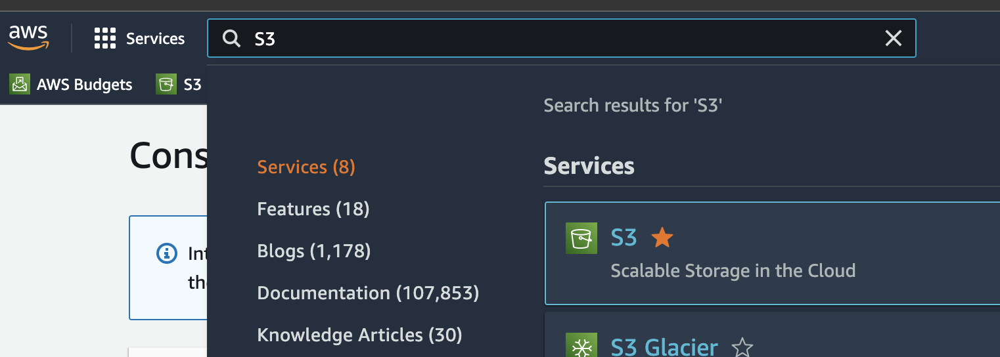
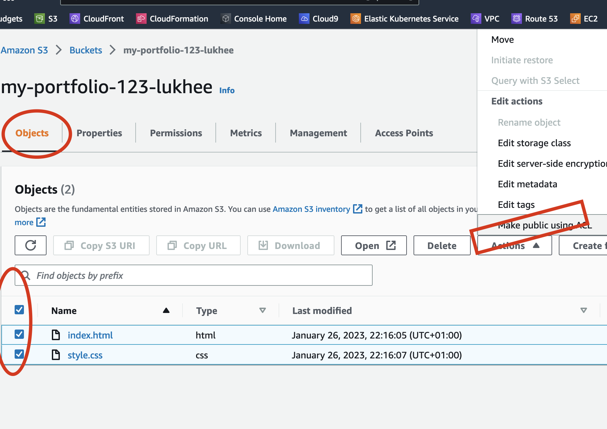
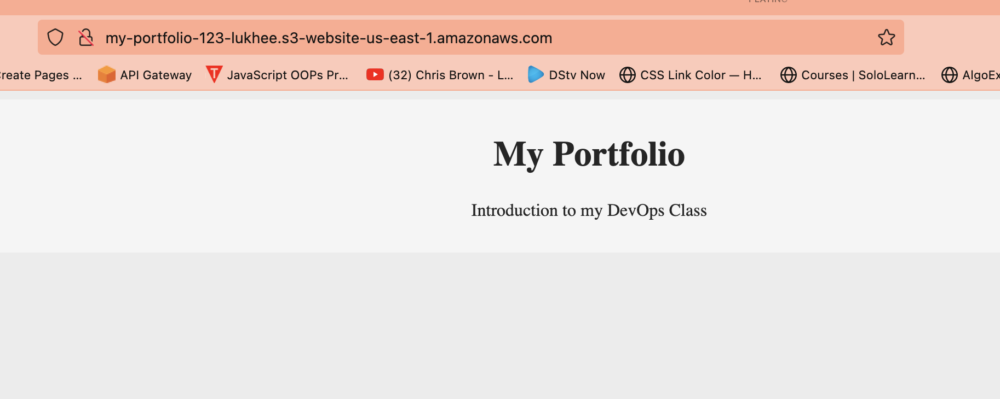
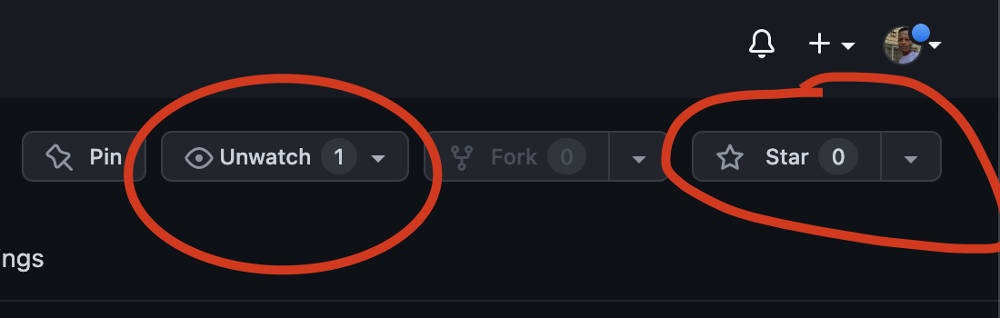

## :rocket: PORTFOLIO PIPELINE CREATION
This is basic of devOps using a personal portfolio to create a pipeline to deploy portfolio file to aws S3 Bucket using circleci automation tool


#### Prerequisites
1. Create [AWS Account](https://aws.amazon.com/)
2. Create [CIRCLECI Account](https://circleci.com/signup/) 

### ⚙️ Steps 
1. AWS 
  - S3 bucket set-up and deploy static files {HTML, CSS and all} with public access URl
  - IAM policy [check here](https://github.com/dev-luqman/DevOps_Room/blob/main/Portfolio/iam-policy.json)


```  ----  ```  ``` --- ``` ``` ---  ``` ``` --- ```


  
```  ----  ```  ``` --- ``` ``` ---  ``` ``` --- ```
```  ----  ```  ``` --- ``` ``` ---  ``` ``` --- ```
```  ----  ```  ``` --- ``` ``` ---  ``` ``` --- ```

2. CircleCI Basic Commands
3. Basic Linus Command
4. Integrating and deploying from github to s3-bucket through circleci

### :book: AWS S3 bucket setup and static website deployment
Please follow the below steps to deploy your static website to s3 bucket

1. Login to [AWS](https://aws.amazon.com/) with your login details


``` --- ```   ``` --- ```   ``` --- ```   ``` --- ```

2. Search for S3 bucket in the search box


``` --- ```   ``` --- ```   ``` --- ```   ``` --- ```

3. Create S3 bucket


  - Enter a unique name for your bucket
  - Enable ACLs 


  - Allow Block Access to your bucket 
  - Aknowledge the term to public access
  - Leave remaining as default and Click Create


``` --- ```   ``` --- ```   ``` --- ```   ``` --- ```

4. Upload files to New_Bucket
  - Enter your Bucket by clicking on it
  - Upload your file/portfolio from your system [sample File here](https://github.com/dev-luqman/DevOps_Room/tree/main/Portfolio/page)


``` --- ```   ``` --- ```   ``` --- ```   ``` --- ```

5. Enable Public access to files
  - Visit object tab under the bucket created
  - select all files
  - click on action and select ``` Make public using ACL ```
  - Under ``` Make Public ``` page, click Make Public


``` --- ```   ``` --- ```   ``` --- ```   ``` --- ```
  - Still goin on, CLick On ``` Property ``` Tab, 
  - Scroll down to Static website hosting ``` Edit ``` Tab
  

``` --- ```   ``` --- ```   ``` --- ```   ``` --- ```
  - CLick on ``` Enable ```
  - Hosting A Static Website ``` Click ```
  - Index Document section, add ``` index.html ```
  
  


6. Review Url for your File/Website
  - Visit Property Tab once One 
  - Scroll Down to review your url and click to preview
  
  


7.  :rocket: WEBSITE Hosted
  


8. :weary: Error Page 
  - If you get the below error please visit ```Step 5``` or ``` step 1 ```


### :arrow_right: Next We Visit AWS IAM Policy 


``` --- ``` ``` --- ``` ``` --- ```
 ### :fireworks: Star and watch for more
