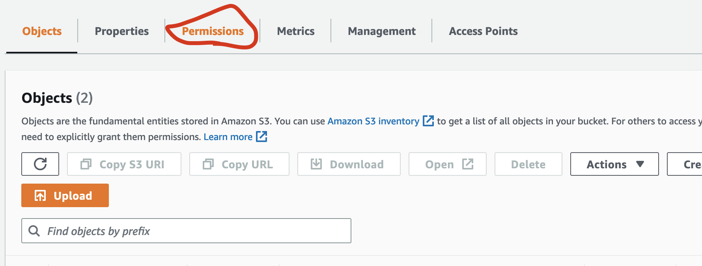
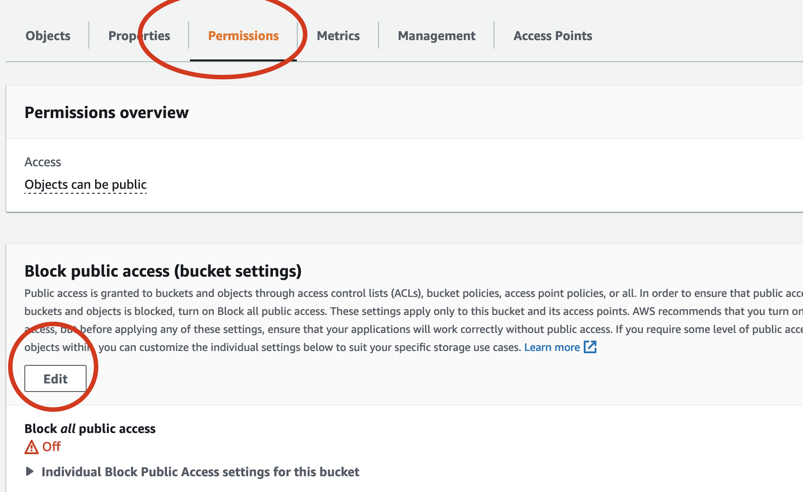
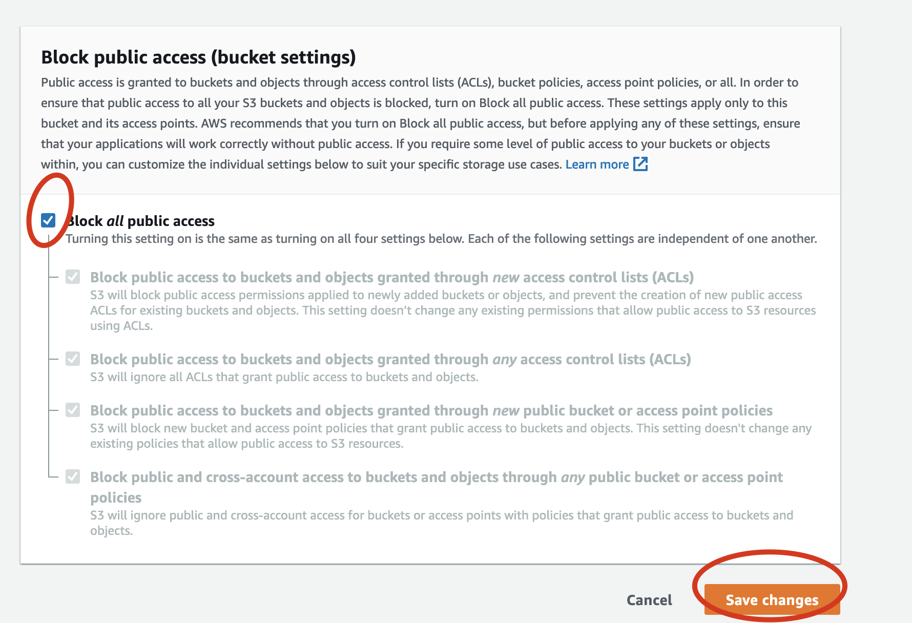
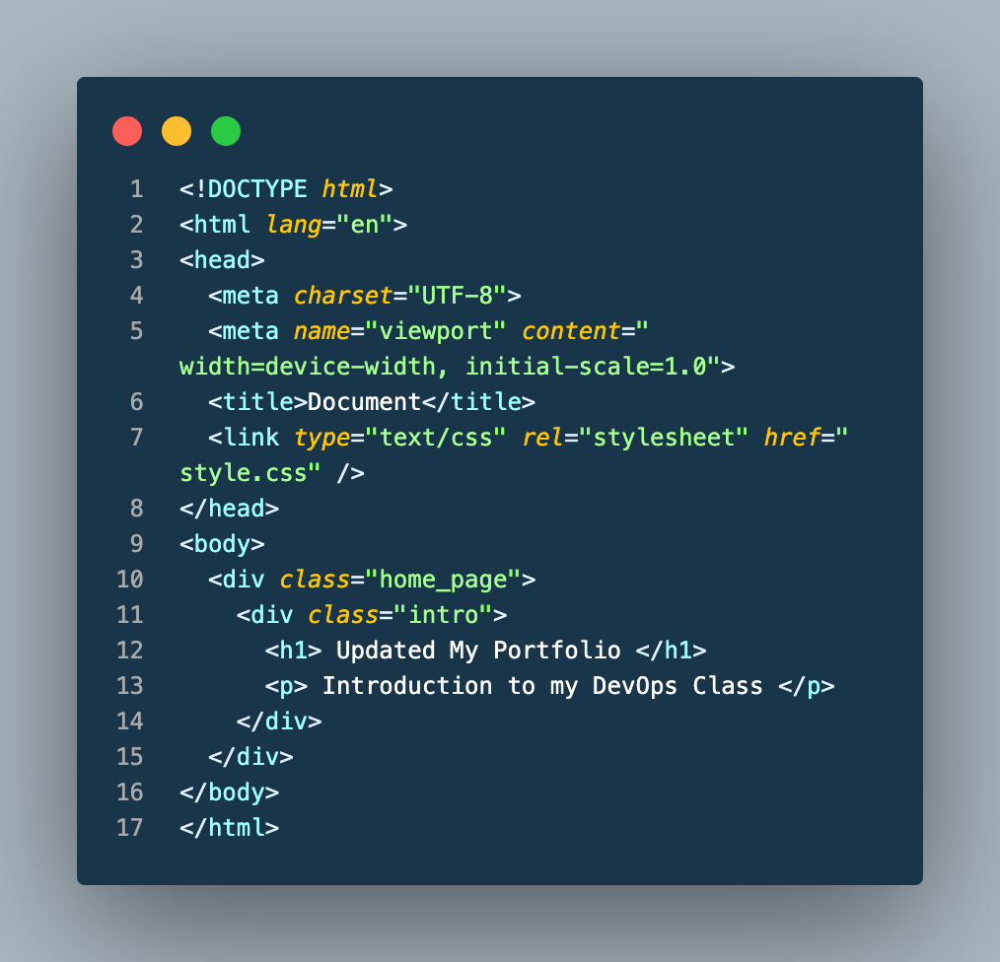
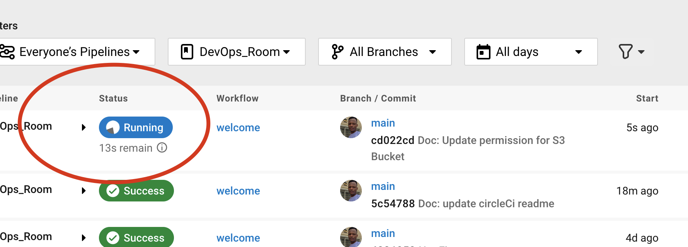
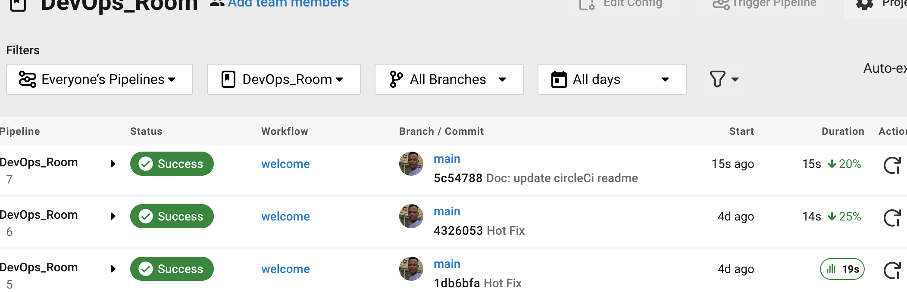
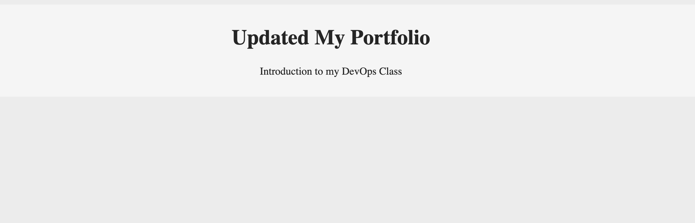

## :rocket: DEPLOYING FROM CIRCLECI PIPELINE TO S3 BUCKET
Here we will be updating our portfolio to github and connect circleci pipeling to deploy to S3 bucket 

### Prerequisite
1. Updating S3 bucket to be hosting our website from  AWS CloudFront
  - :note: When ever we update our file to S3 bucket, we will always need to expose the file to public view which will defeat our automation process.
  - In order to avoid such, we will be using AWS CloudFront for hosting our s3_bucket to Edge Location 

### ⚙️ Steps 1 - Hosting to CloudFront (Edge Location)
- Follow [YOUTUBE VIDEO](https://www.youtube.com/watch?v=-DDGYzKtNwc)
``` OR ```
- Visit AWS and search for CloudFront


```  ----  ```  ``` --- ``` ``` ---  ``` ``` --- ```

- Create New Cloudfront for your portfolio


```  ----  ```  ``` --- ``` ``` ---  ``` ``` --- ```

- Coneect your S3 bucket and click enter


```  ----  ```  ``` --- ``` ``` ---  ``` ``` --- ```

- Get your CloudFront Url


```  ----  ```  ``` --- ``` ``` ---  ``` ``` --- ```


### ⚙️ Steps 2 - Disable s3_bucket access 
Here we only want access to s3 bucket through cloundfront (CDN)
1. Visit your S3 bucket 
2. Go to the permission tab and proceed





```  ----  ```  ``` --- ``` ``` ---  ``` ``` --- ```
```  ----  ```  ``` --- ``` ``` ---  ``` ``` --- ```
```  ----  ```  ``` --- ``` ``` ---  ``` ``` --- ```


### :rocket: Connecting to Circleci
We will now start connection to circleci throug GitHub to AWS S3(CloudFront/Edge location) access

- Create 
  - ``` .circleCi/config.yml ```
  - folder/file in the root of your portfolio

1. Copy the below command and pasted
[CircleCI_PipelineCode](https://github.com/dev-luqman/DevOps_Room/blob/main/.circleci/config.yml)

:book: Beware of indentation


2. Connect to circleCi


```  ----  ```  ``` --- ``` ``` ---  ``` ``` --- ```

3. Connect to github project


```  ----  ```  ``` --- ``` ``` ---  ``` ``` --- ```

4. Sellect the branch and connect


5. At first your pipeline will fail 


:book: failed as a result of trying to connect aws s3 bucket and found no connection


6. SetUp a AWS connection 


```  ----  ```  ``` --- ``` ``` ---  ``` ``` --- ```


```  ----  ```  ``` --- ``` ``` ---  ``` ``` --- ```

:book: Add your circleci Ennvironment


7. getting your aws IAM credentials
####visit AWS CONSOLE


```  ----  ```  ``` --- ``` ``` ---  ``` ``` --- ```


:book: ensure you save token in a note pad because one time access


```  ----  ```  ``` --- ``` ``` ---  ``` ``` --- ```
```  ----  ```  ``` --- ``` ``` ---  ``` ``` --- ```
```  ----  ```  ``` --- ``` ``` ---  ``` ``` --- ```

8. Let Get back to our pipeline and rerun 


9. Update your portfolio and push to github


```  ----  ```  ``` --- ``` ``` ---  ``` ``` --- ```



10. Check your CLoudfront Url to see the update

```  ----  ```  ``` --- ``` ``` ---  ``` ``` --- ```

