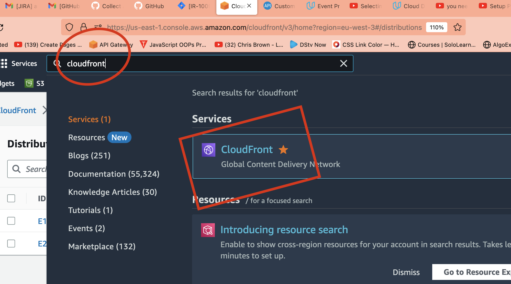

## DEPLOYING FROM CIRCLECI PIPELINE TO S3 BUCKET
Here we will be updating our portfolio to github and connect circleci pipeling to deploy to S3 bucket 

### Prerequisite
1. Updating S3 bucket to be hosting our website from  AWS CloudFront
--- It when ever we update our file to S3 bucket, we will alwasy need to expose the file to public view which will defeated our automation.
--- In order to avoid such, we will be using AWS CloudFront host to Edge Location 

### ⚙️ Steps - Hosting to CloudFront (Edge Location)
- Visit AWS and search for CloudFront


```  ----  ```  ``` --- ``` ``` ---  ``` ``` --- ```

- Create New Cloudfront for your portfolio


```  ----  ```  ``` --- ``` ``` ---  ``` ``` --- ```

- Coneect your S3 bucket and click enter


```  ----  ```  ``` --- ``` ``` ---  ``` ``` --- ```

- Get your CloudFront Url


```  ----  ```  ``` --- ``` ``` ---  ``` ``` --- ```


```  ----  ```  ``` --- ``` ``` ---  ``` ``` --- ```
```  ----  ```  ``` --- ``` ``` ---  ``` ``` --- ```
```  ----  ```  ``` --- ``` ``` ---  ``` ``` --- ```


### :rocket: Connecting to Circleci
We will now start connection to circleci throug GitHub to AWS S3(CloudFront/Edge location) access

- create or copy ~ .circleCi/config.yml ~ folder/file in the root of your portfolio

1. Copy the below command and pasted
```

version: 2.1

jobs:

  Update-S3-Bucket: # Naming of the job to perform
    docker:
      # Select Image to run 
      - image: amazon/aws-cli # AWS docker image used to have access to aws commands pre-populated with it
    steps:
      - checkout # checking into the code - just same as we 

      # Running Normal Command You do in your Ternmmila
      - run: 
          name: Install Packages (tar) # Naming the command to run 
          command: | 
            yum install -y tar gzip

    # Deploy to S3_bucket in aws - Preview Exercise
      - run:
          name: Deploy frontend objects
          command: |
            # list all the file in the directory
            ls -a
            # mode to the directory where your files are
            cd Portfolio/page
            ls -a
            # Please change my-portfolio-123-lukhee to your s3 bucket name
            aws s3 cp style.css s3://my-portfolio-123-lukhee 
            aws s3 cp index.html s3://my-portfolio-123-lukhee
workflows:
  welcome:
    jobs:
      - Update-S3-Bucket

```

:book: Beware of indentation


2. Connect to circleCi


```  ----  ```  ``` --- ``` ``` ---  ``` ``` --- ```

3. Connect to github project


```  ----  ```  ``` --- ``` ``` ---  ``` ``` --- ```

4. Sellect the branch and connect


5. At first your pipeline will fail 


:book: failed as a result of trying to connect aws s3 bucket and found no connection


6. SetUp a AWS connection 


```  ----  ```  ``` --- ``` ``` ---  ``` ``` --- ```


```  ----  ```  ``` --- ``` ``` ---  ``` ``` --- ```

:book: Add your circleci Ennvironment


7. getting your aws IAM credentials
####visit AWS CONSOLE


```  ----  ```  ``` --- ``` ``` ---  ``` ``` --- ```


:book: ensure you save token in a note pad because one time access


```  ----  ```  ``` --- ``` ``` ---  ``` ``` --- ```
```  ----  ```  ``` --- ``` ``` ---  ``` ``` --- ```
```  ----  ```  ``` --- ``` ``` ---  ``` ``` --- ```

8. Let Get back to our pipeline and rerun 


9. Update your portfolio and push to github


10. Check your CLoudfront Url to see the update
