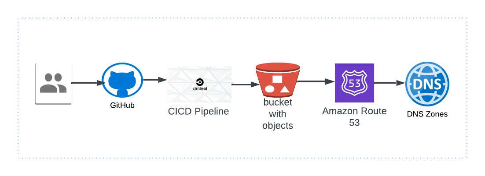

## :rocket: Creating A sample Tutorial Guide to become a DevOps Engineer
This will be a class for becoming a devops by doing the simplest thing closet to you 

### :book:  Classes are listed below
- Porfolio through a pipeline [CLick Here](https://github.com/dev-luqman/DevOps_Room/tree/main/Portfolio)
  - AWS 
    - s3_bucket - [here](https://github.com/dev-luqman/DevOps_Room/tree/main/Portfolio)
    - IAM policy with least access  - [here](https://github.com/dev-luqman/DevOps_Room/tree/main/aws_iam_policy)

  - CircleCi - Automation pipeline  
  
  

### :link: Follow On Social Media For more Update:
[LinkedIn](https://www.linkedin.com/in/lukhee)

### :hugs: Thank You and see you soon for more