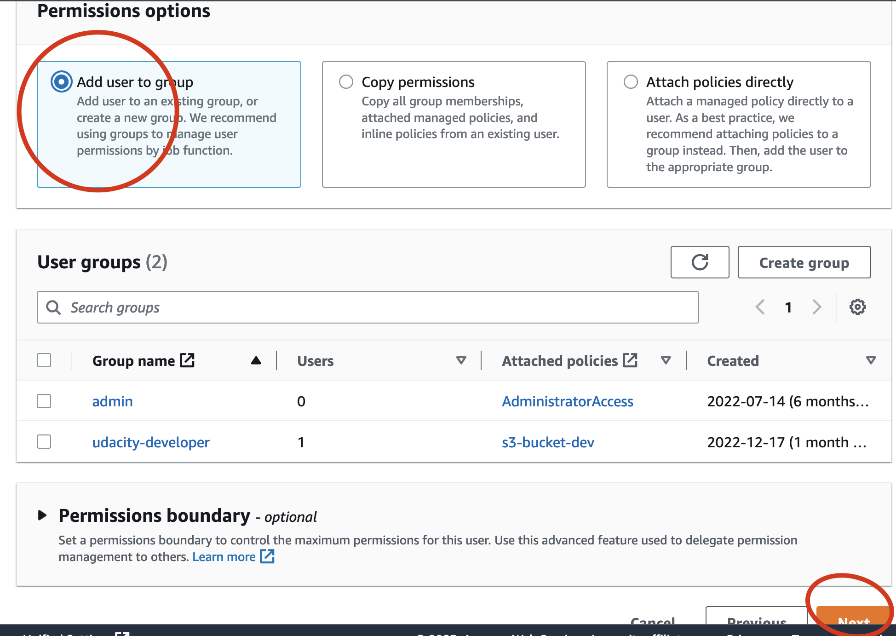
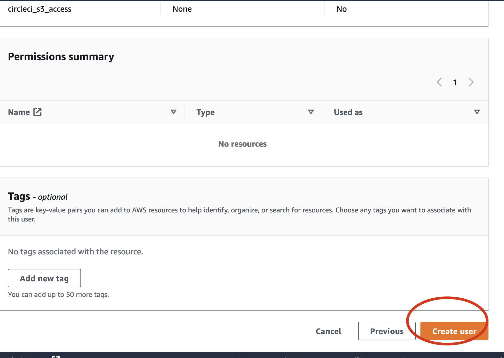
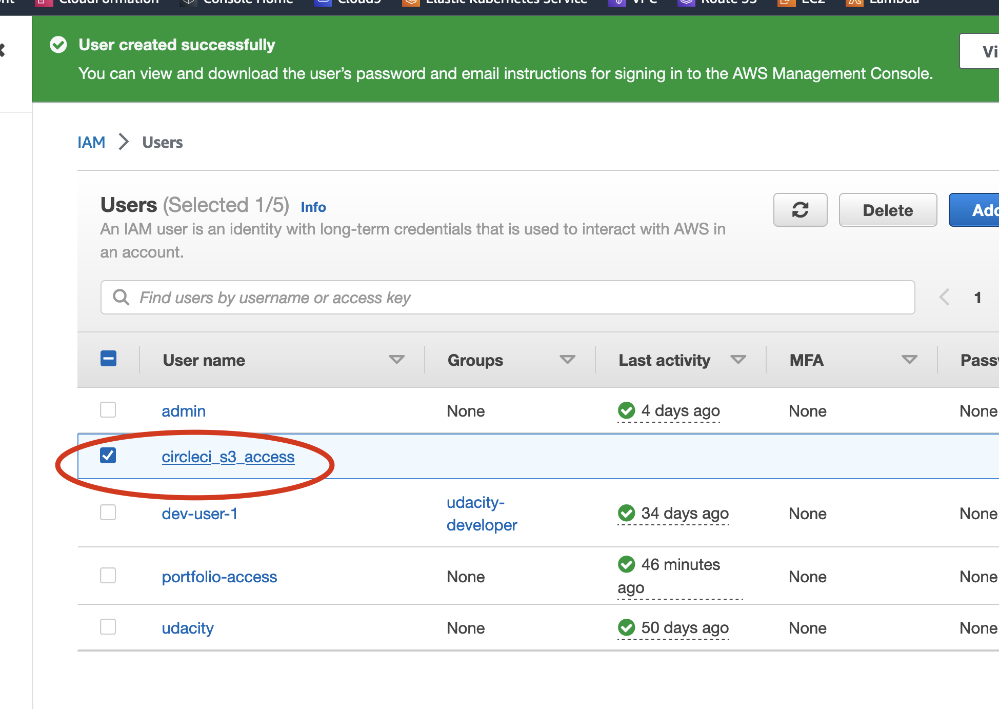
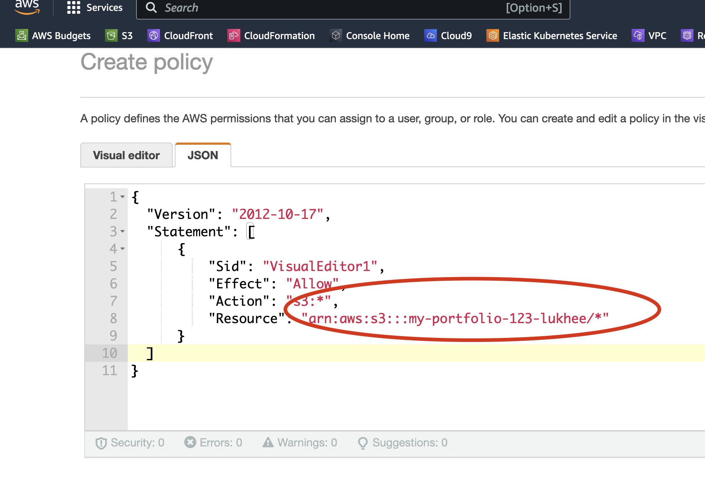

## :rocket: Configuring AWS IAM Role to Access Amazon S3 Bucket
This section describes how to configure a S3 bucket, IAM role, and policies for CircleCi to access an external storage (S3_Bucket) in a secure manner on behalf of one or more individual users in your Circleci account.

As a best practice, limit S3 bucket access to a specific IAM role with the minimum required permissions. The IAM role is created in your AWS account along with the permissions to access your S3 bucket and the trust policy to allow CircleCi to assume the IAM role.


``` --- ```   ``` --- ```  ``` ---- ````

#### Prerequisites
1. Create [AWS Account](https://aws.amazon.com/ 

### ⚙️ Steps 
1. Login to your AWS Account 

```  ----  ```  ``` --- ``` ``` ---  ``` ``` --- ```

2. Search For IAM on the search bar

  
```  ----  ```  ``` --- ``` ``` ---  ``` ``` --- ```
```  ----  ```  ``` --- ``` ``` ---  ``` ``` --- ```

3. Create New User name 

```  ----  ```  ``` --- ``` ``` ---  ``` ``` --- ```

```  ----  ```  ``` --- ``` ``` ---  ``` ``` --- ```
  - Add user detail - Name



  
```  ----  ```  ``` --- ``` ``` ---  ``` ``` --- ```
```  ----  ```  ``` --- ``` ``` ---  ``` ``` --- ```

4. Attach New Policy To The Created User 

```  ----  ```  ``` --- ``` ``` ---  ``` ``` --- ```

```  ----  ```  ``` --- ``` ``` ---  ``` ``` --- ```

```  ----  ```  ``` --- ``` ``` ---  ``` ``` --- ```

```  ----  ```  ``` --- ``` ``` ---  ``` ``` --- ```


```  ----  ```  ``` --- ``` ``` ---  ``` ``` --- ```
```  ----  ```  ``` --- ``` ``` ---  ``` ``` --- ```
```  ----  ```  ``` --- ``` ``` ---  ``` ``` --- ```
```  ----  ```  ``` --- ``` ``` ---  ``` ``` --- ```
  - To access the ARN name for your policy 
    - goto your s3 bucket
    - click on your bucket name 
    - click on the property tab


``` 
// Give all s3 bucket action that can be performed
// specific resource to grant access to

{
  "Version": "2012-10-17",
  "Statement": [
      {
          "Sid": "VisualEditor1",
          "Effect": "Allow",
          "Action": "s3:*",  
          "Resource": "arn:aws:s3:::<my-bucket-name>/*"   
      }
  ]
}

```


### :arrow_right: CircleCI configuration 
  <!-- - IAM policy with least access  - [here](https://github.com/dev-luqman/DevOps_Room/tree/main/aws_iam_policy) -->


``` --- ``` ``` --- ``` ``` --- ```
 ### :fireworks: Star and watch for more
